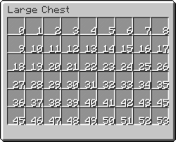

# InvSON
> Create GUI in PaperMC with JSON.

<br/>

<br/>

## 예시코드
```json
{
  "id": "", // <- 겹치지 않게 하기
  "type": "", // <- 사용자가 따로 제작이 가능합니다. root 에 무조건 frame 적어주세요
  "title": "", // <- GUI 이름 적어주세요.
  "size": , // <- 사이즈는 최소값 9 최대값 54
  "contents": [
      {
        "type": "itemstack", // <- itemstack,formattable,component 세가지만 가능합니다.
        "slot": 5, // <- GUI에 아이템 넣을 슬롯에 숫자를 입력해주세요.
        "name": "Not intractable item", // <- 아이템에 이름을 적어주세요.
        "lore": ["..."], // <- 아이템 밑에 덧붙일 설명을 적어주세요.
        "material": "minecraft:cobblestone" // <- 아이템명을 적어주세요.
      },
      {
        "type": "formattable", // <- itemstack,formattable,component 세가지만 가능합니다.
        "id": "changethis1",  // <- 겹치지 않게 하기
        "x": 4,  // <- slot or x y 로 작성해주세요.
        "y": 2
      },
      {
        "type": "component", // <- itemstack,formattable,component 세가지만 가능합니다.
        "slot": 7, // <- slot 은 GUI에 아이템 넣을 슬롯에 숫자를 입력해주세요.
        "class": "IntractableComponent", // implements IComponent
        "name": "shit", // <- 아이템에 이름을 적어주세요.
        "lore": ["asdfasdfad"], // <- 아이템 밑에 덧붙일 설명을 적어주세요.
        "material": "minecraft:cobblestone",  // <- 아이템명을 적어주세요.
        "arguments": {
          "onClick": "redirect://xyz/yellowstrawberry/wow/shit"  // <- 이벤트 핸들러
        }
      }
    ],
  "panes": [""] // <- 
}
```